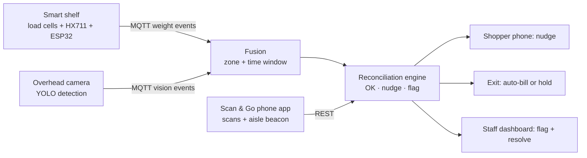

# ScanTrust

Sensor-fusion loss prevention for **Scan & Go**. Shoppers scan items on their own phone and walk out; a smart shelf (weight) and an overhead camera (vision) quietly check that what they picked up matches what they scanned.

Built for the **Everseen Computer Vision AI Hackathon**, Problem Statement 2: *Mobile Scan and Go – Checkout Anywhere Loss Prevention*.

**Live demo:** open `docs/index.html` in a browser, or the GitHub Pages link once enabled (Settings → Pages → Deploy from branch → `main` / `docs`). It runs entirely in the browser, no install needed.

## Project status

| Part | Status |
|---|---|
| Decision engine (`backend/scantrust/engine.py`) | Done; covered by the pytest suite |
| REST API, simulator and web demo | Done; the shelf is **simulated** on screen |
| ESP32 load-cell firmware | Written, **not yet run on real hardware** |
| Camera script (`vision/detect.py`) | Written; **no model trained on our products yet** |
| MQTT bridge to real shelf and camera | Written, **not yet tested end to end** |
| Physical smart shelf | Planned for the finale |

## How it works



1. The shopper starts a session in the app. An aisle beacon tells the system which aisle their phone is in.
2. A pick on the shelf drops the zone's weight by one unit. The camera confirms which product it was and whose hand took it.
3. The **reconciliation engine** keeps a per-shopper ledger of picks vs scans. After a grace period:

| Situation | Action |
|---|---|
| Picked and scanned (either order) | Nothing. The shopper never notices. |
| Picked, not scanned | Gentle nudge on the phone: "Looks like you picked up X. Tap to add it." |
| Scanned a cheaper product than the one taken | Flag to staff as a possible barcode swap |
| Put back after scanning | Removed from the cart automatically |
| Camera blocked (weight only) | Tracked; blocks exit only if repeated |
| Can't tell which shopper picked | Logged for analytics, no action |

**Design rule: precise rather than perfect.** Only high-confidence picks (one shopper in reach *and* camera agrees with the shelf) ever trigger an action. Wrongly accusing an honest shopper costs a store more than one missed item.

## Repository layout

```
backend/            Python reconciliation engine + FastAPI server
  scantrust/
    engine.py       the core logic (well tested)
    catalog.py      products, unit weights and shelf zones
    app.py          REST API + serves the web UI
    mqtt_bridge.py  ESP32 + camera events over MQTT → engine
  simulate.py       plays the three demo scenarios, no hardware needed
  tests/            pytest suite for the engine
web/                Shopper phone, smart shelf and staff dashboard UI
  engine.js         JavaScript port of the engine (for the browser-only demo)
firmware/           ESP32 + HX711 load-cell firmware (Arduino)
vision/             YOLO detection script for the overhead camera
scripts/            build_demo.py → docs/index.html (live demo)
docs/               static live demo for GitHub Pages
```

## Run it

### 1. Software only (laptop)

```bash
cd backend
python -m venv .venv && source .venv/bin/activate   # Windows: .venv\Scripts\activate
pip install -r requirements.txt
pytest                                   # engine tests
uvicorn scantrust.app:app --reload       # open http://localhost:8000
```

In a second terminal, play the finale scenarios against the running server:

```bash
python simulate.py            # honest shopper, forgotten scan, barcode swap
```

Set `SCANTRUST_GRACE_S` to change how long the engine waits before nudging (default 10 s).

### 2. With the smart shelf

1. Install [Mosquitto](https://mosquitto.org/) on the laptop and start it (`mosquitto -v`).
2. Wire 4 load cells to 4 HX711 modules and the ESP32 (pins at the top of `firmware/esp32_shelf/esp32_shelf.ino`).
3. Set your Wi-Fi, the laptop's IP as `MQTT_HOST`, calibrate each zone, and flash.
4. Start the API with the bridge on: `MQTT_HOST=localhost uvicorn scantrust.app:app`.

The ESP32 publishes `scantrust/shelf/<zone>/event` with `{"delta": 1}` on a pick and `-1` on a put-back. Publishing `on` / `off` to `scantrust/shelf/staff` pauses detection during restocking.

### 3. With the camera

```bash
cd vision
pip install -r requirements.txt
python detect.py --model yolov8n.pt --source 0 --show          # check zones and camera placement
python detect.py --model best.pt --source 0 --mqtt localhost    # after training on your products
```

Training notes are at the top of `vision/detect.py`.

## Deploy

**Live demo (static, no server):** Settings → Pages → Source: *Deploy from a branch* → `main`, folder `/docs` → Save. After a minute it is live at `https://<your-username>.github.io/scantrust/`.

**Backend API + UI (Render, free):** sign in at [render.com](https://render.com) with GitHub → New → Blueprint → pick this repo. `render.yaml` sets everything up. The UI is then at `https://scantrust-<id>.onrender.com`. The free plan sleeps after inactivity, so the first visit can take about a minute; state resets when it restarts.

## API

| Method | Path | Body |
|---|---|---|
| POST | `/api/sessions` | `{"name": "Ravi"}` |
| POST | `/api/sessions/{id}/aisle` | `{"aisle": "A3"}` or `{"aisle": null}` |
| POST | `/api/sessions/{id}/scan` | `{"sku": "SOAP", "qty": 1}` |
| POST | `/api/sessions/{id}/exit` | |
| POST | `/api/shelf` | `{"zone": "A3-Z2", "delta": 1, "vision_sku": "SOAP", "vision_conf": 0.9, "session_hint": "S001"}` |
| POST | `/api/alerts/{id}/resolve` | `{"outcome": "charged"}` or `{"outcome": "ok"}` |
| GET | `/api/state` | sessions, alerts, event log |

Interactive docs: http://localhost:8000/docs

## Known limitations

- Two shoppers at one shelf without hand tracking: the pick is logged, not acted on.
- Bluetooth beacons locate a phone to an aisle, not a shelf; scan timing decides the match.
- Loose produce and very light items are out of scope for this phase.
- `session_hint` from person tracking is not implemented in `vision/detect.py` yet; the demo UI simulates it.
- State is in memory; restart clears it. A database is the next step for a real pilot.

## Team

- Srivastav: hardware and edge (load cells, ESP32, MQTT)
- [Name]: vision model and tracking
- [Name]: shopper app and staff dashboard
- [Name]: reconciliation logic and pitch
